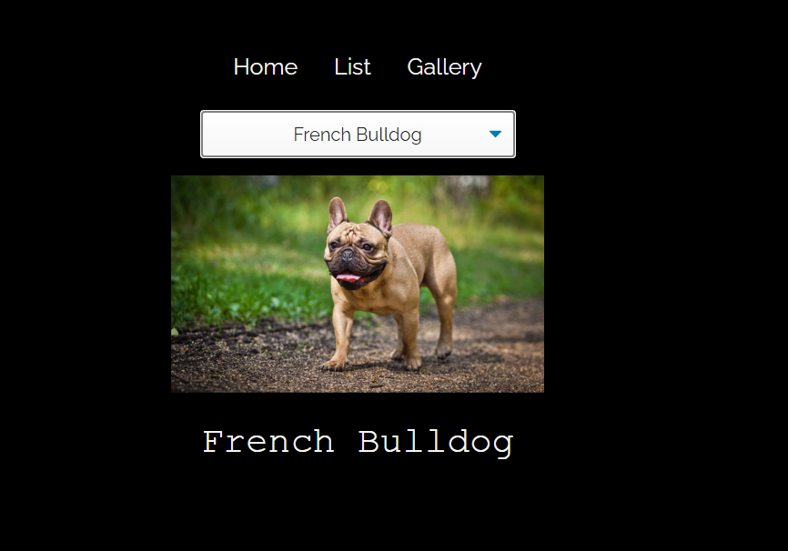

# Breeds App V1.0

Connected to apiDog and used calls to paint MAGIC.

Hope enjoy the breeds 😍

--- 

## Application preview 📱

--- 

## Available Scripts

In the project directory, you can run:

If you clone it! Don´t forget before start the project to 👀:
### `npm i`

## To run & start 👨‍💻
### `npm start`

---
## Runs the app in the development mode.\
Open [http://localhost:3000](http://localhost:3000) to view it in your browser.

The page will reload when you make changes.\
You may also see any lint errors in the console.

## Learn More

You can learn more in the [Create React App documentation](https://facebook.github.io/create-react-app/docs/getting-started).

To learn React, check out the [React documentation](https://reactjs.org/).
